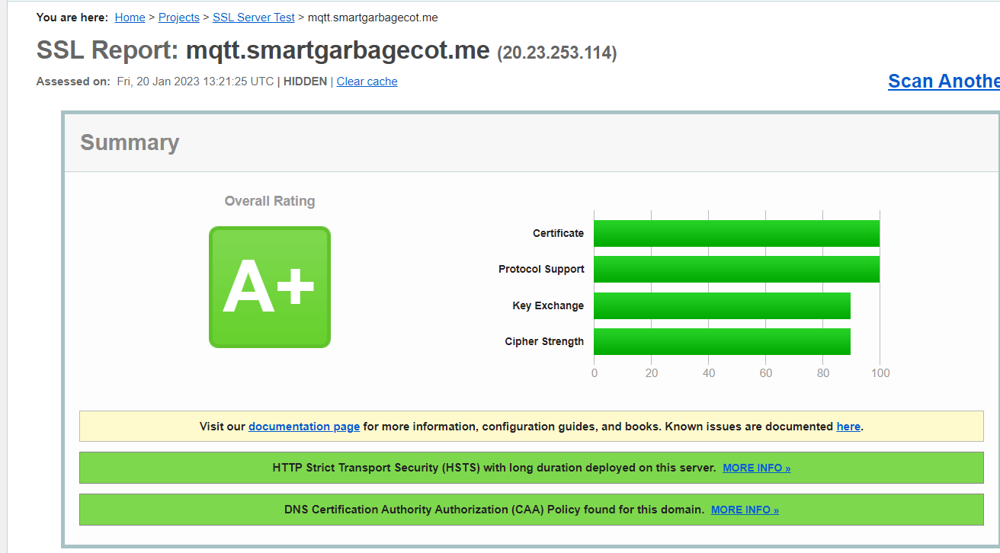
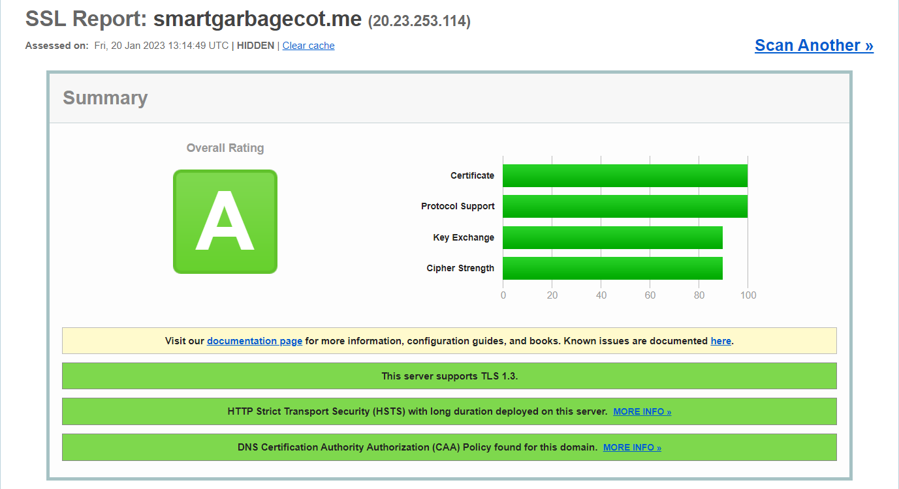

# Smart-Garbage-Monitoring-System

This project was realized as part of the Cloud of Things module at Sup'Com, dedicated to monitor pollution in cities to help municipalities.

This project was done by:
- Rihab Jerbi
- Bedis Mansar

## Context

This project aims to assist municipalities with a smart garbage monitoring system to help combat pollution in cities. As the cities grow in population,
The level of waste proportionally grow as well to a scale that threatens the environment and that renders municipalities jobs much harder.
Therefore, to facilitate their job of safeguarding the environment, our project provides the following functionalities:
- Detect, display the level of waste in garbage cans and emphasize on garbage bins that exceed the threshhold.
- Provide the optimal path to clear the garbage cans.

## Demo

The mobile application can be tested with the apk located in the "APK" folder. The admin dashbboard is currently hosted on https://smartgarbagecot.me. You can view a demo of the mobile application [here](https://www.canva.com/design/DAFYN69sjlA/acsfiw305thY1z000dnFDw/watch?utm_content=DAFYN69sjlA&utm_campaign=designshare&utm_medium=link2&utm_source=sharebutton&fbclid=IwAR1izz-2TqcPLJdtSKw7uBJ-D_Sq6kGSzvsrfyzuvgEHQB4Tw-xHEeGGvFQ).

## Technologies

These are the technologies necessary to run this project:
- Wildfly preview 26.1.2 final
- JDK 17.0.2
- Flutter
- Node-red
- Mosquitto Broker
- Google maps api
- Openstreetmap
- Raspberry pi 3
- HC-SR04 ultrasonic sensor
- MongoDB

## Installation Guide

- Clone this repository
- Import flows.json located in "IOT" on Node-red.
- Create a microprofile-properties.config folder in middleware/META-INF folder as indicated in the user guide.
- Create a JWT keystore as mentionned in the user guide and store it in jboss configuration directory.
- package the middleware code into a single.war file with Intellij and place in wildfly/standalone/deployments folder.
- Use "standalone.bat" to run wildfly
- Copy the apk and install it on your phone to test the phone.
- Test the dashboard in localhost:8080

## Deployment machine

With our school mail, we can get a 100$ voucher inside of Microsoft Azure. With this voucher, we can create a virtual machine capable of hosting
the middleware, the mosquitto broker and the database. The virtual machine have the following characteristics:
- Ram: 4 Gib
- vCPUS: 2
- Resource disk size: 8 Gib

## Certifications and grading

We have enabled HTTPS with letsencrypt TLS certificate with HSTS enabled as well, ensuring only secure connections are allowed to the middleware. 
Enabling TLS1.2 only on Wildfly helps generate A+ grading on SSlabs.

When enabling only TLS1.3 , even though it is more secure, it only generates A grading which is due to SSlabs grading system that does not rate servers with TLS1.3 only as A+. 

Enabling TLS1.3 and TLS1.2 generates an A grading, because SSlabs rates that the server is now vulnerable to a downgrade attack. SSlab only rates servers with TLS1.3 as A+ if they
support TLS Fallback Signaling Cipher Suite Value to prevent the downgrade attack. However, JBOSS wildfly does not provide its own SSL implementation. Wildfly relies on the SSL implementation by the JVM. Currently, this functionality has not been added Oracle JDK or OpenJDK.
